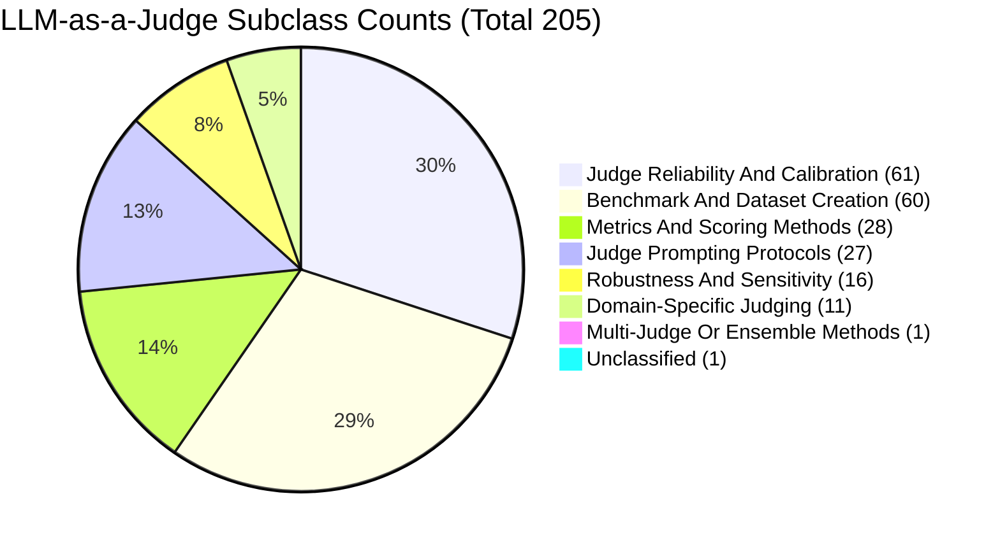
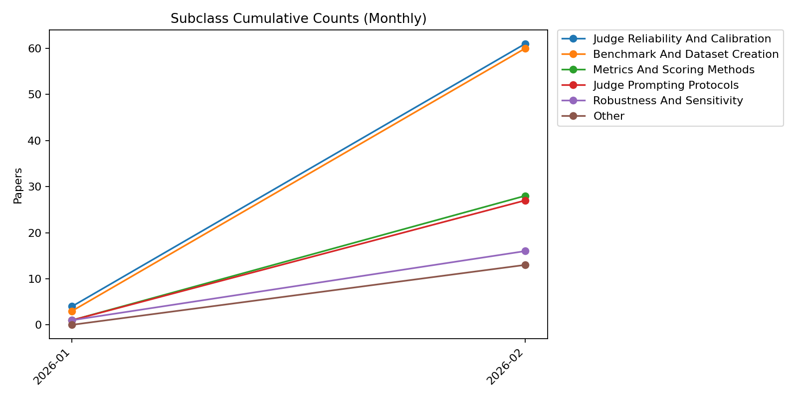
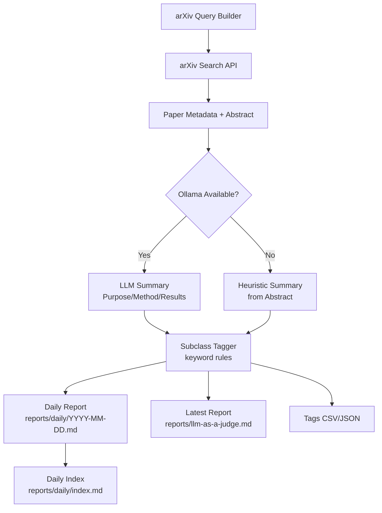

# LLM-as-a-Judge arXiv Monitor

This repo includes a scheduled collector that searches arXiv for "LLM as a Judge" papers and writes a Markdown report for GitHub reading.

Run manually:

```bash
uv run python scripts/collect_llm_judge_arxiv.py --days-back 90
```

Output:
- `reports/llm-as-a-judge.md`

Automation:
- GitHub Actions workflow formats Python on push.

## Subclass Counts (All Daily Reports)

<!-- TAG_STATS_START -->

Legend (Series Order): 1. Judge Reliability And Calibration (61) | 2. Benchmark And Dataset Creation (60) | 3. Metrics And Scoring Methods (28) | 4. Judge Prompting Protocols (27) | 5. Robustness And Sensitivity (16) | 6. Domain-Specific Judging (11) | 7. Multi-Judge Or Ensemble Methods (1) | 8. Unclassified (1)
<!-- TAG_STATS_END -->

## Subclass Summaries

- Judge Prompting Protocols: How to prompt or structure judges to improve reliability and consistency. Example topics: rubrics, pairwise prompts, calibration prompts, chain-of-thought constraints.
- Robustness And Sensitivity: Sensitivity to surface changes or adversarial inputs. Example topics: lexical/syntactic perturbations, prompt sensitivity, adversarial stress tests.
- Benchmark And Dataset Creation: New datasets and benchmarks for LLM evaluation. Example topics: curated corpora, evaluation suites, domain benchmarks.
- Judge Reliability And Calibration: Agreement with humans, bias analysis, and calibration of judge scores. Example topics: inter-annotator agreement, bias audits, calibration curves.
- Domain-Specific Judging: Applying LLM-as-a-judge to specialized domains. Example topics: medical, legal, education, software, history.
- Multi-Judge Or Ensemble Methods: Combining multiple judges/models to reduce variance and bias. Example topics: ensemble voting, consensus, multi-judge aggregation.
- Metrics And Scoring Methods: New scoring functions or evaluation metrics. Example topics: probabilistic scoring, metric design, scoring reliability.

### Representative Papers (Auto)

<!-- CATEGORY_SUMMARY_START -->
- [Preserving Historical Truth: Detecting Historical Revisionism in Large Language Models]([arXiv](http://arxiv.org/abs/2602.17433v1))
- [The Emergence of Lab-Driven Alignment Signatures: A Psychometric Framework for Auditing Latent Bias and Compounding Risk in Generative AI]([arXiv](http://arxiv.org/abs/2602.17127v1))
- [LiveClin: A Live Clinical Benchmark without Leakage]([arXiv](http://arxiv.org/abs/2602.16747v1))
- [Assessing Large Language Models for Medical QA: Zero-Shot and LLM-as-a-Judge Evaluation]([arXiv](http://arxiv.org/abs/2602.14564v1))
- [When LLM Judges Inflate Scores: Exploring Overrating in Relevance Assessment]([arXiv](http://arxiv.org/abs/2602.17170v1))
- [Multi-Objective Alignment of Language Models for Personalized Psychotherapy]([arXiv](http://arxiv.org/abs/2602.16053v1))
- [On the Reliability of User-Centric Evaluation of Conversational Recommender Systems]([arXiv](http://arxiv.org/abs/2602.17264v1))
- [Quantifying and Mitigating Socially Desirable Responding in LLMs: A Desirability-Matched Graded Forced-Choice Psychometric Study]([arXiv](http://arxiv.org/abs/2602.17262v1))
- [Same Meaning, Different Scores: Lexical and Syntactic Sensitivity in LLM Evaluation]([arXiv](http://arxiv.org/abs/2602.17316v1))
- [MILE-RefHumEval: A Reference-Free, Multi-Independent LLM Framework for Human-Aligned Evaluation]([arXiv](http://arxiv.org/abs/2602.09624v1))
- [CodeCircuit: Toward Inferring LLM-Generated Code Correctness via Attribution Graphs]([arXiv](http://arxiv.org/abs/2602.07080v1))
<!-- CATEGORY_SUMMARY_END -->

### Weekly Trend Summary (Auto)

<!-- WEEKLY_TREND_START -->
- Week ending 2026-02-20 (UTC).
- Benchmark And Dataset Creation: 22 (+4 vs prior week)
- Domain-Specific Judging: 4 (+0 vs prior week)
- Judge Prompting Protocols: 9 (+0 vs prior week)
- Judge Reliability And Calibration: 26 (+9 vs prior week)
- Metrics And Scoring Methods: 11 (+4 vs prior week)
- Multi-Judge Or Ensemble Methods: 0 (-1 vs prior week)
- Robustness And Sensitivity: 4 (-3 vs prior week)
<!-- WEEKLY_TREND_END -->

## Subclass Cumulative Trend (Monthly)

<!-- TAG_TREND_START -->


_This image is auto-generated from reports/daily data._
<!-- TAG_TREND_END -->

## LLM-as-a-Judge Design Overview

This tracker uses LLMs only for summarization, while paper discovery remains deterministic via arXiv queries.



## Reports Overview

- `reports/llm-as-a-judge.md`: The main arXiv monitor report (Purpose/Method/Results per paper).
- `reports/llm-as-a-judge_subclasses.md`: Example subclass scheme to group papers while reading the report.
- `reports/llm-as-a-judge_tags.csv`: Structured tags per paper (auto-generated).
- `reports/llm-as-a-judge_tags.json`: Structured tags per paper (auto-generated).
- `reports/daily/`: Daily snapshots with `reports/daily/index.md`.

Backfill example (create daily reports for the last 7 days):

```bash
uv run --no-sync --python .venv/bin/python scripts/collect_llm_judge_arxiv.py --backfill-days 7 --require-llm --skip-failed
```

## Local Daily Run (macOS)

Use launchd to run daily at 08:00 local time, and also retry hourly if missed (e.g., laptop asleep or offline).

1. Update `scripts/com.local.llm_judge_arxiv.plist` by replacing `/ABS/PATH/TO/REPO` with your repo path.
2. Load the job:

```bash
launchctl bootstrap gui/$(id -u) scripts/com.local.llm_judge_arxiv.plist
```

To unload:

```bash
launchctl bootout gui/$(id -u) scripts/com.local.llm_judge_arxiv.plist
```

## Project Setup

This project uses [uv](https://github.com/astral-sh/uv) for Python package management. Follow these steps to set up your development environment:

Run the following commands:

```bash
# Install uv
curl -LsSf https://astral.sh/uv/install.sh | sh

# Clone repository and navigate to project directory
git clone <repository-url>
cd my-project

# Create and activate virtual environment
uv venv
source .venv/bin/activate

# Install project dependencies
uv pip install -e ".[dev]"

# Install and enable JupyterLab code formatter
jupyter labextension install @ryantam626/jupyterlab_code_formatter
jupyter serverextension enable --py jupyterlab_code_formatter
```

This will install all required packages listed in `pyproject.toml`, including both main dependencies and development tools.

## Pre-commit Hooks Setup

This project uses [pre-commit](https://pre-commit.com/) to maintain code
quality. Pre-commit runs a series of checks and formatters on your code before
each commit, ensuring consistent style and catching common issues early.

### Required Libraries and Tools

You need to install the following dependencies:

```bash
pip install pre-commit black isort ruff mypy
npm install -g prettier
brew install hadolint
pre-commit install
```
