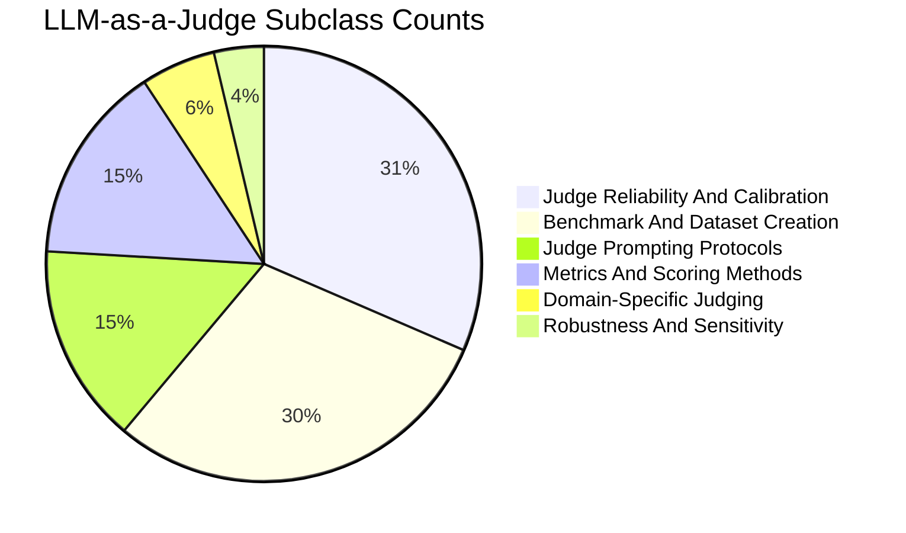
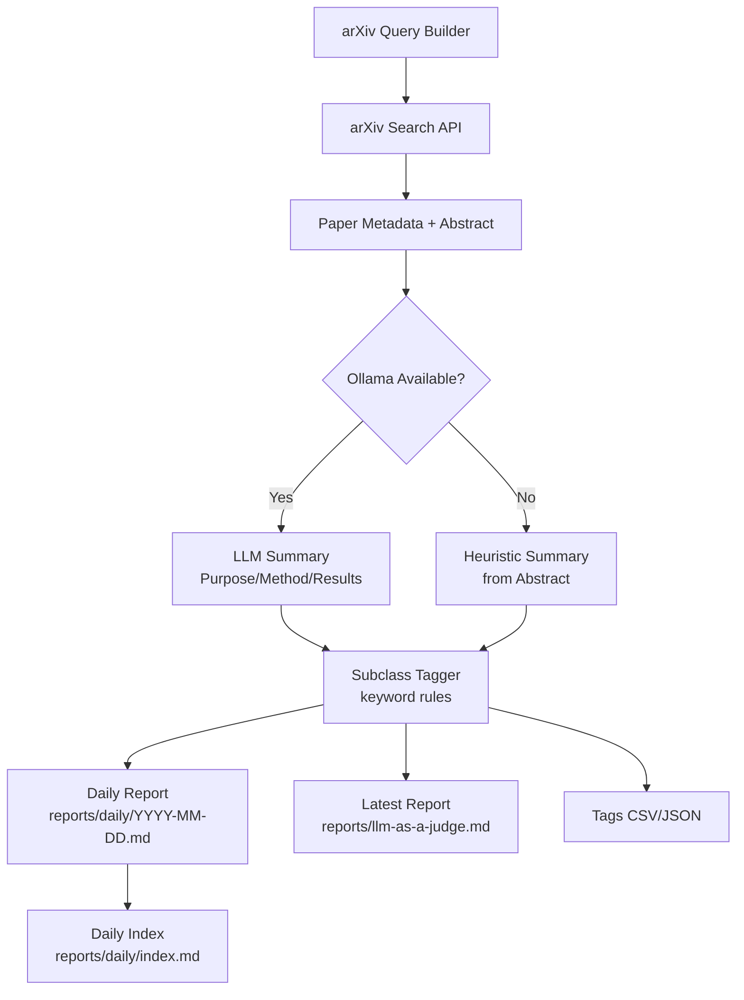

# LLM-as-a-Judge arXiv Monitor

This repo includes a scheduled collector that searches arXiv for "LLM as a Judge" papers and writes a Markdown report for GitHub reading.

Run manually:

```bash
uv run python scripts/collect_llm_judge_arxiv.py --days-back 90
```

Output:
- `reports/llm-as-a-judge.md`

Automation:
- GitHub Actions workflow formats Python on push.

## Subclass Counts (Latest Window)

<!-- TAG_STATS_START -->

<!-- TAG_STATS_END -->

## Subclass Cumulative Trend

<!-- TAG_TREND_START -->
```mermaid
xychart-beta
    title "Subclass Cumulative Counts (Daily)"
    x-axis ["2026-02-19", "2026-02-20"]
    y-axis "Papers" 0 --> 6
    series "Judge Reliability And Calibration" [3, 6]
    series "Metrics And Scoring Methods" [2, 4]
    series "Robustness And Sensitivity" [2, 4]
    series "Benchmark And Dataset Creation" [1, 2]
    series "Judge Prompting Protocols" [1, 2]
```
<!-- TAG_TREND_END -->

## LLM-as-a-Judge Design Overview

This tracker uses LLMs only for summarization, while paper discovery remains deterministic via arXiv queries.



## Reports Overview

- `reports/llm-as-a-judge.md`: The main arXiv monitor report (Purpose/Method/Results per paper).
- `reports/llm-as-a-judge_subclasses.md`: Example subclass scheme to group papers while reading the report.
- `reports/llm-as-a-judge_tags.csv`: Structured tags per paper (auto-generated).
- `reports/llm-as-a-judge_tags.json`: Structured tags per paper (auto-generated).
- `reports/daily/`: Daily snapshots with `reports/daily/index.md`.

Backfill example (create daily reports for the last 7 days):

```bash
uv run --no-sync --python .venv/bin/python scripts/collect_llm_judge_arxiv.py --backfill-days 7 --require-llm --skip-failed
```

## Local Daily Run (macOS)

Use launchd to run daily at 08:00 local time, and also retry hourly if missed (e.g., laptop asleep or offline).

1. Update `scripts/com.local.llm_judge_arxiv.plist` by replacing `/ABS/PATH/TO/REPO` with your repo path.
2. Load the job:

```bash
launchctl bootstrap gui/$(id -u) scripts/com.local.llm_judge_arxiv.plist
```

To unload:

```bash
launchctl bootout gui/$(id -u) scripts/com.local.llm_judge_arxiv.plist
```

## Project Setup

This project uses [uv](https://github.com/astral-sh/uv) for Python package management. Follow these steps to set up your development environment:

Run the following commands:

```bash
# Install uv
curl -LsSf https://astral.sh/uv/install.sh | sh

# Clone repository and navigate to project directory
git clone <repository-url>
cd my-project

# Create and activate virtual environment
uv venv
source .venv/bin/activate

# Install project dependencies
uv pip install -e ".[dev]"

# Install and enable JupyterLab code formatter
jupyter labextension install @ryantam626/jupyterlab_code_formatter
jupyter serverextension enable --py jupyterlab_code_formatter
```

This will install all required packages listed in `pyproject.toml`, including both main dependencies and development tools.

## Pre-commit Hooks Setup

This project uses [pre-commit](https://pre-commit.com/) to maintain code
quality. Pre-commit runs a series of checks and formatters on your code before
each commit, ensuring consistent style and catching common issues early.

### Required Libraries and Tools

You need to install the following dependencies:

```bash
pip install pre-commit black isort ruff mypy
npm install -g prettier
brew install hadolint
pre-commit install
```
